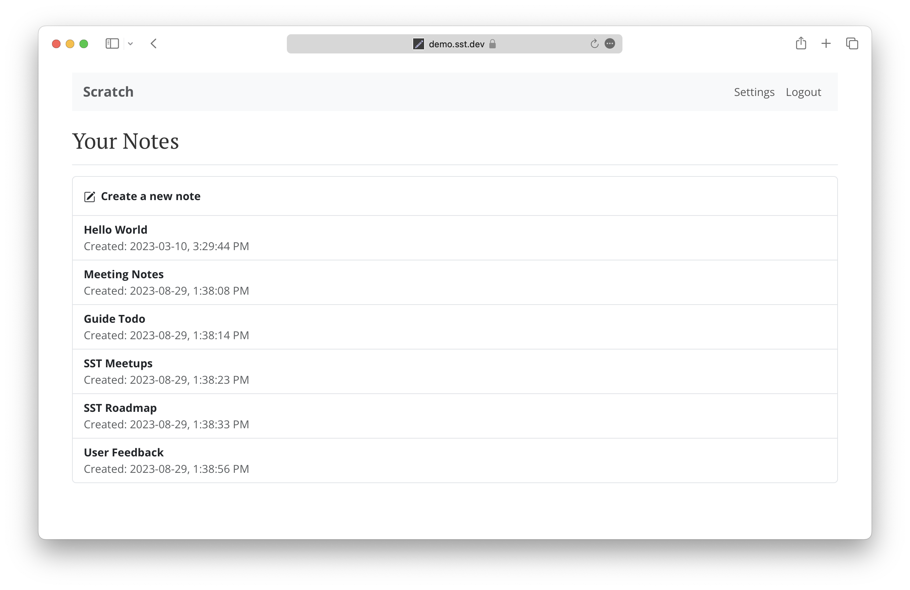

<p align="center">
  <a href="https://serverless-stack.com/">
    
  </a>
</p>

<p align="center">
  <b>Learn to Build Full-Stack Apps with Serverless and React</b>
</p>

<p align="center">
  <a href="https://discourse.serverless-stack.com"></a>
  <a href="https://twitter.com/Anomaly_Inv"></a>
  <a href="https://gitter.im/serverless-stack/Lobby"></a>
</p>

------------------------------------------------------------------------------------

[Serverless Stack](https://serverless-stack.com) is an open source guide for building and deploying full-stack apps using Serverless and React on AWS.

We are going to create a [note taking app](https://demo2.serverless-stack.com) from scratch using React.js, AWS Lambda, API Gateway, DynamoDB, and Cognito.



It is a single-page React app powered by a serverless CRUD API. We also cover how add user authentication and handle file uploads.

The entire guide is hosted on GitHub and we use [Discourse][Discourse] for our comments. With the help of the community we add more detail to the guide and keep it up to date.

## Project Goals

- Provide a free comprehensive resource
- Add more content to build on core concepts
- Keep the content accurate and up to date
- Help people resolve their issues

## Getting Help

- If you are running into issues with a specific chapter, post in the comments for that [chapter][Discourse].
- Open a [new issue](../../issues/new) if you've found a bug
- Or if you have a suggestion create a [new topic][Discourse] in our forums
- If you've found a typo, edit the chapter and submit a [pull request][PR].

## Source for the Demo App

- [Backend Serverless API](https://github.com/AnomalyInnovations/serverless-stack-demo-api)
- [Frontend React app](https://github.com/AnomalyInnovations/serverless-stack-demo-client)

## Contributing

Thank you for your considering to contribute. [Read more about how you can contribute to Serverless Stack][Contributing].

## Running Locally

Serverless Stack is built using [Jekyll](https://jekyllrb.com). [Follow these steps to install Jekyll](https://jekyllrb.com/docs/installation/).

#### Viewing Locally

To install, run the following in the root of the project.

``` bash
$ bundle install
```

And to view locally.

``` bash
$ bundle exec jekyll serve
```

You can now view the guide locally by visiting `http://localhost:4000/`.

You can also turn on live reloading and incremental builds while editing.

``` bash
$ bundle exec jekyll serve --incremental --livereload
```

#### Generating the eBook

We use [Pandoc](https://pandoc.org) to create the eBook. You can generate it locally by following these steps.

``` bash
$ cd ~/Sites/ServerlessStackCom/etc/ebook
$ make start
```

This'll start a Docker instance. Inside the Docker run:

``` bash
$ make pdf
$ make epub
```

The above are run automatically through [Github Actions](https://github.com/AnomalyInnovations/serverless-stack-com/actions) in this repo:

- When a new commit is pushed to master
- And when a new tag is pushed, the generated eBook is uploaded to S3

## Sponsors

<a target="_blank" href="https://epsagon.com/serverless-stack/?utm_source=Advertisement&utm_medium=cpm&utm_campaign=ServerlessStack">
  
</a>

[**Sponsor Serverless Stack on GitHub**](https://github.com/sponsors/jayair) if you've found this guide useful or would like to be an official supporter. [A big thanks to our supporters](https://serverless-stack.com/sponsors.html)!

## Maintainers

Serverless Stack is maintained by [Anomaly Innovations](https://anoma.ly/). [**Subscribe to our newsletter**](https://emailoctopus.com/lists/1c11b9a8-1500-11e8-a3c9-06b79b628af2/forms/subscribe) for updates on Serverless Stack.

## Contributors

Thanks to these folks for their contributions to the content of Serverless Stack.

- [Peter Eman Paver Abastillas](https://github.com/jatazoulja): Social login chapters
- [Bernardo Bugmann](https://github.com/bernardobugmann): Translating chapters to Portuguese
- [Sebastian Gutierrez](https://github.com/pepas24): Translating chapters to Spanish and adding copy button for code snippets
- [Vincent Oliveira](https://github.com/vincentoliveira): Translating chapters to French
- [Leonardo Gonzalez](https://github.com/leogonzalez): Translating chapters to Portuguese
- [Vieko Franetovic](https://github.com/vieko): Translating chapters to Spanish
- [Christian Kaindl](https://github.com/christiankaindl): Translating chapters to German
- [Jae Chul Kim](https://github.com/bsg-bob): Translating chapters to Korean


[Discourse]: https://discourse.serverless-stack.com
[Contributing]: CONTRIBUTING.md
[PR]: ../../compare


