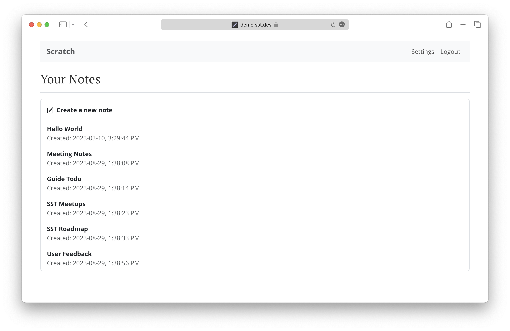

# Introduction

**Serverless Stack** is an open source guide for building full-stack production ready apps using Serverless and React on AWS. Create a note taking app from scratch using the Serverless Framework and Create React App. Follow our step-by-step tutorials with screenshots and code samples. And use our forums if you have any questions.

# Who Is This Guide For?

This guide is meant for full-stack developers or developers that would like to build full stack serverless applications. By providing a step-by-step guide for both the frontend and the backend we hope that it addresses all the different aspects of building serverless applications. There are quite a few other tutorials on the web but we think it would be useful to have a single point of reference for the entire process. This guide is meant to serve as a resource for learning about how to build and deploy serverless applications, as opposed to laying out the best possible way of doing so.

So you might be a backend developer who would like to learn more about the frontend portion of building serverless apps or a frontend developer that would like to learn more about the backend; this guide should have you covered.

We are also catering this solely towards JavaScript developers for now. We might target other languages and environments in the future. But we think this is a good starting point because it can be really beneficial as a full-stack developer to use a single language (JavaScript) and environment (Node.js) to build your entire application.

**For help and discussion**
[Comments on this chapter](https://discourse.serverless-stack.com/t/who-is-this-guide-for)


#  What Does This Guide Cover?

To step through the major concepts involved in building web applications, we are going to be building a simple note taking app called [**Scratch**](https://demo2.serverless-stack.com).




**For help and discussion**
[Comments on this chapter](https://discourse.serverless-stack.com/t/who-is-this-guide-for)


# AWS Lambda

However, due to the optimization noted above, the actual Lambda function is invoked only once per container instantiation. Recall that our functions are run inside containers. So when a function is first invoked, all the code in our handler function gets executed and the handler function gets invoked. If the container is still available for subsequent requests, your function will get invoked and not the code around it.

For example, the `createNewDbConnection` method below is called once per container instantiation and not every time the Lambda function is invoked. The `myHandler` function on the other hand is called on every invocation.

``` javascript
var dbConnection = createNewDbConnection();

exports.myHandler = function(event, context, callback) {
  var result = dbConnection.makeQuery();
  callback(null, result);
};
```

## Pricing

Finally, Lambda functions are billed only for the time it takes to execute your function. And it is calculated from the time it begins executing till when it returns or terminates. It is rounded up to the nearest 100ms.

Note that while AWS might keep the container with your Lambda function around after it has completed; you are not going to be charged for this.

Lambda comes with a very generous free tier and it is unlikely that you will go over this while working on this guide.

| Service             | Rate          | Cost  |
| ------------------- | ------------- | -----:|
| Cognito             | Free<sup>[1]</sup> | $0.00 |
| API Gateway         | $3.5/M reqs + $0.09/GB transfer | $2.20 |
| Lambda              | Free<sup>[2]</sup> | $0.00 |
| DynamoDB            | $0.0065/hr 10 write units, $0.0065/hr 50 read units<sup>[3]</sup> | $2.80 |
| S3                  | $0.023/GB storage, $0.005/K PUT, $0.004/10K GET, $0.0025/M objects<sup>[4]</sup> | $0.24 |
| CloudFront          | $0.085/GB transfer + $0.01/10K reqs | $0.86 |
| Route53             | $0.50 per hosted zone + $0.40/M queries | $0.50 |
| Certificate Manager | Free | $0.00 |
| **Total** | | **$6.10** |

[1] Cognito is free for < 50K MAUs and $0.00550/MAU onwards.  
[2] Lambda is free for < 1M requests and 400000GB-secs of compute.  
[3] DynamoDB gives 25GB of free storage.  
[4] S3 gives 1GB of free transfer.

**For help and discussion**
[Comments on this chapter](https://discourse.serverless-stack.com/t/who-is-this-guide-for)


# Create a Login Page

Let's create a page where the users of our app can login with their credentials. When we created our User Pool we asked it to allow a user to sign in and sign up with their email as their username. We'll be touching on this further when we create the signup form.

So let's start by creating the basic form that'll take the user's email (as their username) and password. [Setup a Stripe account](localhost:1234/)

## Add the Container

Create a new file `src/containers/Login.js` and add the following.

``` coffee
import React, { Component } from "react";
import { Button, FormGroup, FormControl, ControlLabel } from "react-bootstrap";
import "./Login.css";

export default class Login extends Component {
  constructor(props) {
    super(props);

    this.state = {
      email: "",
      password: ""
      test: `${myVariable} is concatenated here`,
    };
  }

  validateForm() {
    return this.state.email.length > 0 && this.state.password.length > 0;
  }

  handleChange = event => {
    this.setState({
      [event.target.id]: event.target.value
    });
  }

  handleSubmit = event => {
    event.preventDefault();
  }

  render() {
    return (
      <div className="Login">
        <form onSubmit={this.handleSubmit}>
          <FormGroup controlId="email" bsSize="large">
            <ControlLabel>Email</ControlLabel>
            <FormControl
              autoFocus
              type="email"
              value={this.state.email}
              onChange={this.handleChange}
            />
          </FormGroup>
          <FormGroup controlId="password" bsSize="large">
            <ControlLabel>Password</ControlLabel>
            <FormControl
              value={this.state.password}
              onChange={this.handleChange}
              type="password"
            />
          </FormGroup>
          <Button
            block
            bsSize="large"
            disabled={!this.validateForm()}
            type="submit"
          >
            Login
          </Button>
        </form>
      </div>
    );
  }
}
```

We are introducing a couple of new concepts in this.

1. In the constructor of our component we create a state object. This will be where we'll store what the user enters in the form.

2. We then connect the state to our two fields in the form by setting `this.state.email` and `this.state.password` as the `value` in our input fields. This means that when the state changes, React will re-render these components with the updated value.

3. But to update the state when the user types something into these fields, we'll call a handle function named `handleChange`. This function grabs the `id` (set as `controlId` for the `<FormGroup>`) of the field being changed and updates its state with the value the user is typing in. Also, to have access to the `this` keyword inside `handleChange` we store the reference to an anonymous function like so: `handleChange = (event) => { } `.

4. We are setting the `autoFocus` flag for our email field, so that when our form loads, it sets focus to this field.

5. We also link up our submit button with our state by using a validate function called `validateForm`. This simply checks if our fields are non-empty, but can easily do something more complicated.

6. Finally, we trigger our callback `handleSubmit` when the form is submitted. For now we are simply suppressing the browsers default behavior on submit but we'll do more here later.

Let's add a couple of styles to this in the file `src/containers/Login.css`.

``` css
@media all and (min-width: 480px) {
  .Login {
    padding: 60px 0;
  }

  .Login form {
    margin: 0 auto;
    max-width: 320px;
  }
}
```

These styles roughly target any non-mobile screen sizes.

## Add the Route

Now we link this container up with the rest of our app by adding the following line to `src/Routes.js` below our home `<Route>`.

``` coffee
<Route path="/login" exact component={Login} />
```

And include our component in the header.

``` javascript
import Login from "./containers/Login";
```

Now if we switch to our browser and navigate to the login page we should see our newly created form.


Next, let's connect our login form to our AWS Cognito set up.

**For help and discussion**
[Comments on this chapter](https://discourse.serverless-stack.com/t/who-is-this-guide-for)
